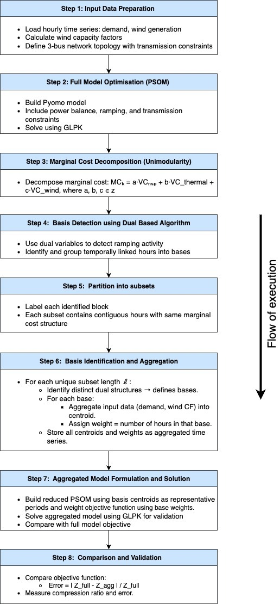

# Context 

This project is based on the paper "Enhancing time series aggregation for power system optimization models: Incorporating network and ramping constraints" by David Cardona-Vasquez, Thomas Klatzer, Bettina Klinz, and Sonja Wogrin (DOI: https://doi.org/10.1016/j.epsr.2024.110267).

Power system optimization models (PSOMs) are essential for planning sustainable energy systems. However, full hourly PSOMs over long horizons are computationally intensive, limiting their use in long-term planning and real-time applications. To address this, time series aggregation (TSA) techniques replace the full hourly model with a smaller, representative model.

TSA approaches fall into two categories:

- **A-priori methods:** Rely solely on input data, largely ignoring model structure or performance. Examples include down-sampling and fixed representative periods. Down-sampling fails to capture short-term dynamics, while fixed-period representation may not accurately reflect the full model’s sensitivity to variability.

- **A-posteriori methods:** Incorporate both data and PSOM structure. A prominent a-posteriori technique is Basis-Oriented TSA, which provides an exact approximation of the full model by identifying contiguous intervals (basis windows) where the set of binding constraints remains constant.

This research focuses on extending the Basis-Oriented approach to complex PSOMs that include additional constraints specifically, thermal generator ramping and network (DC flow) constraints. Ramping constraints introduce complexity due to the variable length of consecutive binding periods, while network constraints add intertemporal coupling across buses.
## Research Questions

- Can Basis-Oriented TSA be extended to include network and ramping constraints while maintaining exact results?

- Are fixed-length representative periods (e.g., days or weeks) sufficient, or are variable-length periods necessary for accurate aggregation?

# Installation

## Prerequisites
- python3.9
- pip
- GLPK Solver (https://www.gnu.org/software/glpk/)
- Data source: [Hourly Open Power System Data for Austria from 01-01-2015 to 31-12-2025](https://data.open-power-system-data.org/time_series/2020-10-06/time_series_60min_singleindex.csv). Download the data and keep it under `data/opsd-time_series-2020-10-06` path)
## How to run

#### 1. Clone the repository
```
git clone https://github.com/your-user/model-aggregation.git
cd model-aggregation
```

#### 2. Create Virtual Environment and activate it

```
python -m venv venv
```

#### 3. Install dependencies

```
pip install -r requirements.txt
```

#### 4. Run the workflow

```
python aggregation.py
```

# Workflow



# Results

After running, you will see in the console:

- **Full model objective:** Total cost of the full-scale dispatch.

- **Aggregated model objective:** Cost on the reduced centroid model.

- **Relative error (%):** Percentage deviation between aggregated and full objectives.

- **Hours reduced:** Reduction in time-steps (e.g., 4,368 → 120 windows).

A summary table:

- Window lengths and counts.

- Number of unique dual bases per length.

- Average and total objective contributions for each window size.

A parallel-coordinates plot visualizes:

- Wind capacity factor, demand, and dual values (ramp up/down, wind) across basis clusters.